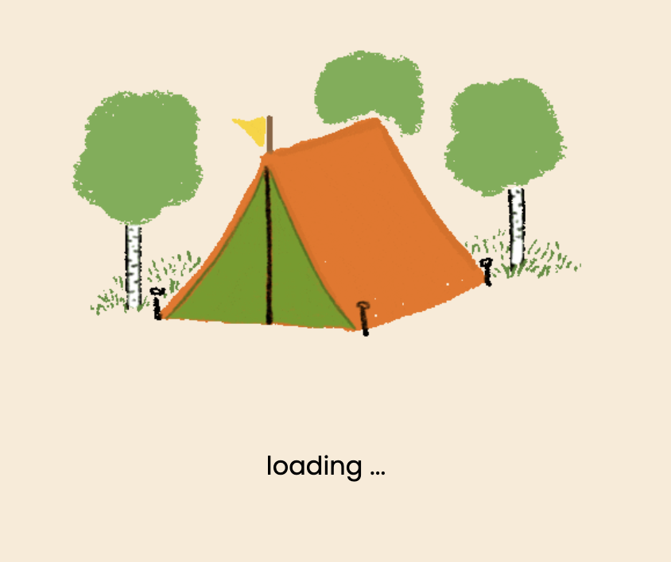

# Project 3: Life's a Pitch

## Deployment Link

[Life's A Pitch](https://lifesapitch.netlify.app)

## Link to Front / Backend

[Front end repository!][Frontend]

[Frontend]: https://github.com/joemarney/unit-3-project-lifesapitch-frontend

[Back end repository!][Backend]

[Backend]: https://github.com/joemarney/unit-3-project-lifesapitch-backend

## Code Installation

[GitHub Link](https://github.com/joemarney/unit-3-project-lifesapitch-frontend.git)

## Brief

Build a full stack CRUD app. The back-end made with Express and Node while the front-end made with React. The API will be secured using JWTs. The front-end will utilise AJAX to communicate with the back-end.

### Timeframe

Work completed by Joe Marney and Finn McDougall.
We had 1 week to create the application.

## Technologies Used

    - Node.js
    - MongoDB
    - React
    - dbdiagram.io
    - FIGMA
    - NOTION
    - Netlify
    - Visual Studio Code
    - Visual Studio Live Share
    - Google Sheets
    - GitHub
    - Cloudinary
    - Chrome Dev Tools
    - Google Fonts
    - ChatGPT

### Dependencies:

    - axios
    - express
    - morgan
    - bcryptjs
    - connect-mongo
    - dotenv
    - mongoose
    - cors
    - jsonwebtoken
    - react
    - react-router-dom
    - react-dom
    - sass
    - reactjs-popup
    - mapbox-gl
    - @mapbox/search-js-react
    - serverless-http

## Planning

For our collaboration project we decided to use NOTION to plan and structure our app.
(Notion can allow all users to collaborate on a single folder as well as create Tasks, embed files etc)

Our initial focus was planning out the key features we wanted to see within the app (at this stage we didn’t have a theme in mind but decided to flesh out the app to build a theme on)

After deciding on full CRUD, as well as some interesting stretch goals and basic layouts, we settled on a camping style app.

This app allows people to rate and review campsites they’ve been to, as well as allowing users that class as ‘campsite owners’ to add their own campsites to them database for judgement.

## Build Process

1. Setup Notion and collaborate on the key features and theme of the app
2. Extensive planning of the Wireframe, Routing Tables, ERD and User Stories
3. Setup the framework for us to work on
   - Creating a collaborative Git repository
   - Setting up the backend server
   - Setting up the frontend
   - Installing all the packages
   - Adding in boilerplate code
   - Linking MongoDB to our app
   - Laying out the Structure with pseudocode
4. From there we focused on the backend first
   - Creating models
   - Creating controllers
   - Setting up middleware
   - Setting up routes
5. After setting up the backend with Express, we moved onto the frontend with React
   - Very similar to the setup of the back end, we started this section by creating the necessary folders, files and boiler plate for the code
   - We then decided to kick off the sign up / out / in components
   - In turn we had to create the services, utilities and interceptors
   - We then got stuck on a sign out but in which we decided to come back to it after creating the simpler pages. We decided that we wanted to see progress after being stuck on the bug for a while
   - Then we added all of the campsite components and functionality. This was the main part of our project so we assumed this would take the most time.
   - We added full CRUD to this section of the app, ensuring that users had to be logged on to be able to add their own campsites.
   - We ran into a few bugs here and there but we were able to fix them all.
6. After that, we decided to style. We generally left this to last as this is a simpler part of the process. One that we are both able to do our own thing without worrying about logic or bugs.
7. Finally we added a bit more to the 'profile' and 'About Us' section of the code as we wanted to flesh it out a bit more.
8. We deployed the backend first and tested out the routes ont he front end. We had to ensure that the paths were all correct.
9. After testing and bugfixing we deployed the front end too.

## Challenges

We had problems with the `.compareSync()` function in the sign in route. There was a difference with the password key on the user model and the req.body we were passing into the bcrypt function.

Problems with `campsite.deleteOne()` - Instead we opted for `findByIdAndDelete()`

Deploying with Netlify came as a challenge. Inputting the frontend and backend links as environment variables within the Netlify GUI had a trailing slash by default and it made all of our routes return 404's.

## Wins

I enjoyed using sass to apply styles to our application. It is intuitive to me and being able to style the elements that are nested within other elements without affecting others on the page is very useful.

Using MapBox to find the campsite by address and then displaying the location on a map.

I made a carousel component that takes the images uploaded by the campsite owner and displays them for users to see on the campsite's personal page.

We found that the communication between the front end and back end can be slow at times. I created a loading page component which makes the app have a more seamless experience for the end user.

## Bugs

Some 404 errors show up in the console while navigating the app. The app is fully functional and the error is MapBox api related.

## Future Improvements / Stretch

In the planning phase of this project we had big ideas for the app and I will definitely be revisiting to apply these stretch goals.

The plan is to make a hidden side of the app for people who enjoy wild camping. It is illegal in the UK and I think having an app where people can share good spots to camp in would be useful. Also my vision is for people to be held accountable if they create mess or disturbance. If somebody books a spot for a weekend they are putting their name on it and if they do bad things they can be reported by other users.

During planning we also wanted to add a profile page which shows a user's favourite campsites and feedback given. This is something we did not manage to get on to during the given time frame but is something I want to look at during free time.
